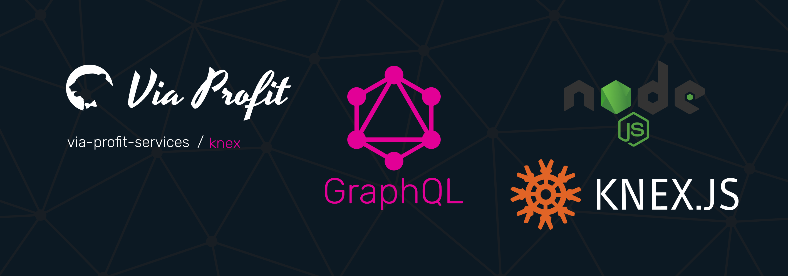

# Via Profit services / Knex Provider

> Via Profit services / **Knex** - Database provider.

This module is a provider that extends the GraphQL [Сontext](https://github.com/via-profit-services/core/blob/master/README.md#context) by adding `Knex` instance with an already initialized connection to your database.

## Documentation [here](https://node.e1g.ru/packages/knex)

## License
The  [MIT](./LICENSE) License.